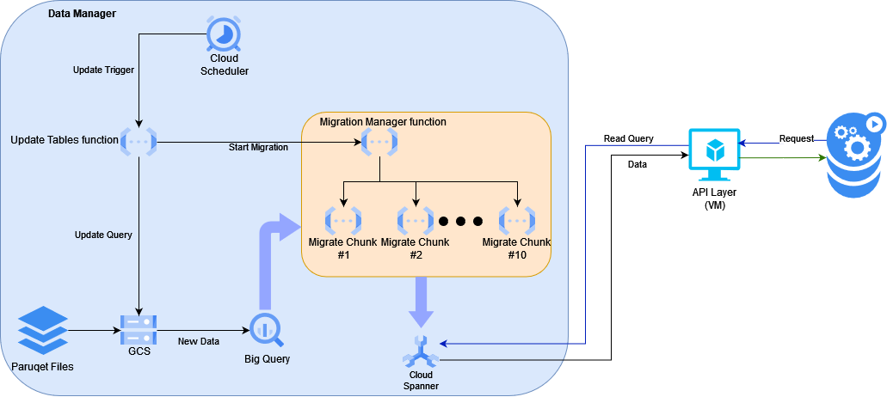

# PlayPerfect Home Assignment
## GCP
### Resources
- Project ID: playperfect-432410
- [IAM and Admin](https://console.cloud.google.com/iam-admin/iam?referrer=search&hl=en&project=playperfect-432410)
- [Project Admin](https://console.cloud.google.com/welcome/new?project=playperfect-432410&hl=en)
- [BigQuery API](https://console.cloud.google.com/apis/api/bigquery.googleapis.com/metrics?hl=en&project=playperfect-432410)
  - Client ID: 182487233470-e4qcnqhgdmqe80pm6jmhtpb2n7vu86kk.apps.googleusercontent.com
- [Google Storage](https://console.cloud.google.com/storage/browser/game-events-bucket?hl=en&project=playperfect-432410)
- [Cloud Functions](https://console.cloud.google.com/functions/list?referrer=search&hl=en&project=playperfect-432410)
- [Cloud Scheduler](https://console.cloud.google.com/cloudscheduler?referrer=search&hl=en&project=playperfect-432410)

### Pipeline

- The Function was deployed manually
- the files in the "pipeline" difectory:
- - main.py = code for the updating app
- - requirements.txt = packages for the function
- - user_panel.sql = Initially used as the query for generating the user_panel table