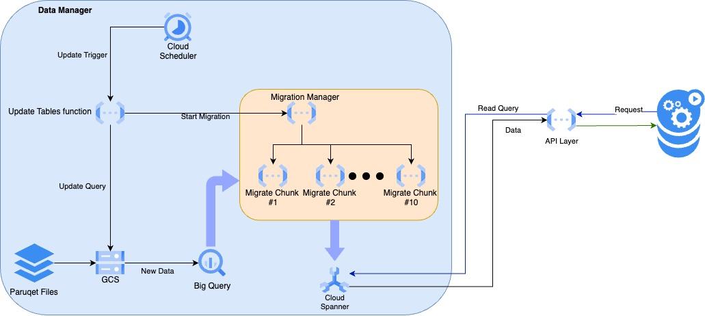
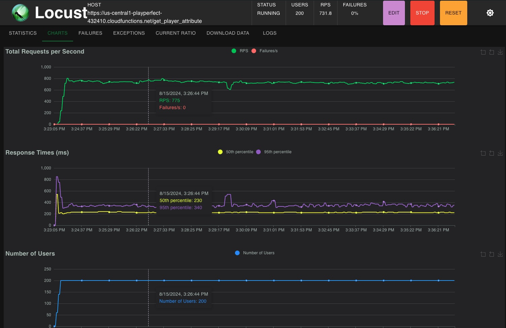
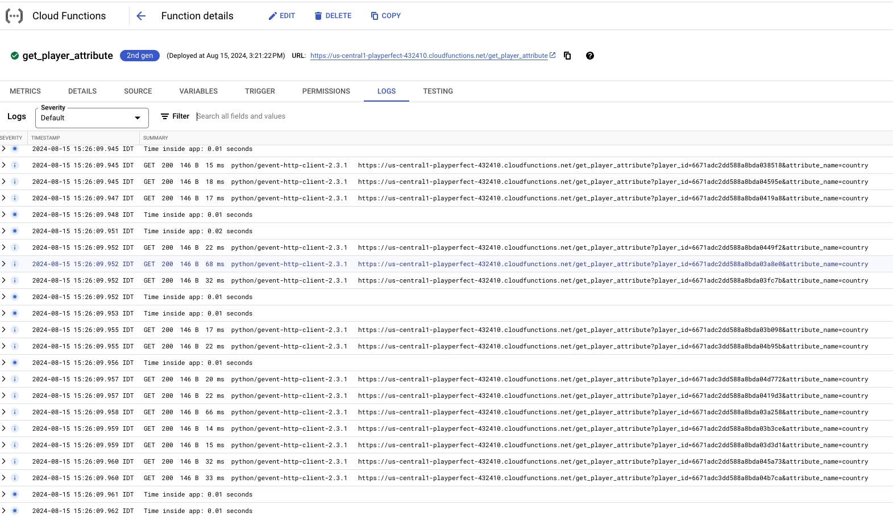

# PlayPerfect Home Assignment
## GCP Resources
- Project ID: playperfect-432410
- [IAM and Admin](https://console.cloud.google.com/iam-admin/iam?referrer=search&hl=en&project=playperfect-432410)
- [Project Admin](https://console.cloud.google.com/welcome/new?project=playperfect-432410&hl=en)
- [BigQuery API](https://console.cloud.google.com/apis/api/bigquery.googleapis.com/metrics?hl=en&project=playperfect-432410)
  - Client ID: 182487233470-e4qcnqhgdmqe80pm6jmhtpb2n7vu86kk.apps.googleusercontent.com
- [Google Storage](https://console.cloud.google.com/storage/browser/game-events-bucket?hl=en&project=playperfect-432410)
- [Google Spanner](https://console.cloud.google.com/spanner/instances?authuser=1&project=playperfect-432410)
- [Cloud Functions](https://console.cloud.google.com/functions/list?referrer=search&hl=en&project=playperfect-432410)
- [Cloud Scheduler](https://console.cloud.google.com/cloudscheduler?referrer=search&hl=en&project=playperfect-432410)
- [Cloud Compute](https://console.cloud.google.com/compute/instances?authuser=1&project=playperfect-432410)

## Architecture

### Data Manager
Loading the data from the paruqet files to the BigQuery, and trigger its copy to Google Spanner storage.

* A Scheduler is set to run the update_user_panel function every 4 hours.
* Once finish update the user_panel table, the app triggers the migration_manager

### Migration Manager
Handles the migration of the data from BigQuery to the Google Spanner.
* Migration manager receives the trigger from the data manager, splits the data to chunks and runs multiple services in parallel to load it to the spanner.
* Migrate Chunk function receives the information to load to the spanner.
* Loading the data supplied, 100K rows, from the BigQuery to the Spanner, using the default setup of 10 concurrent migrators, takes approximately 30 sec. This can be adjusted to accommodate the growth of users.

### API Layer
Handles requests from clients.
The implementation of the API layer was initially done with a VM (get_user_attribute_spanner_vm.py), which resulted with poor performance. 
So, I switched to Function, which gave much better results.

## Performance
* The image below is a screenshot of the locust run.

* The image below is the function logs

#### Notes:
- As you can see, though there are much more than 100 RPS (required), the response time seen is 350ms on the 95th percentile.
This would be mostly a network latency, rather than the app response which much lower as clearly seen in the logs, which looks like avereging below the 50ms marker (this should be verified...). 

## To Do
In addition to some TODOs in the code, here are a few more general stuff that need to be addressed.

### Operations
* Proper application run
  Currently the API is running from within a Tmux session so that it wont stop then the SSH is closed. 
  This should be modified for production level.

### Unit testing
* Extend the simple tests to a more thorough tests that cover all relevant functionalities of each unit
  
### DevOps/IT
* Security
- To save time on mingling with the GCP permissions/roles/IAM, I've decided to set the apps have permissions to be run by "allUsers". This, of course, should be modified to adhere with production standards.

* Setup CI/CD (preferably Github Actions)
